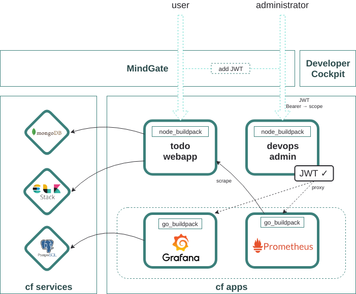
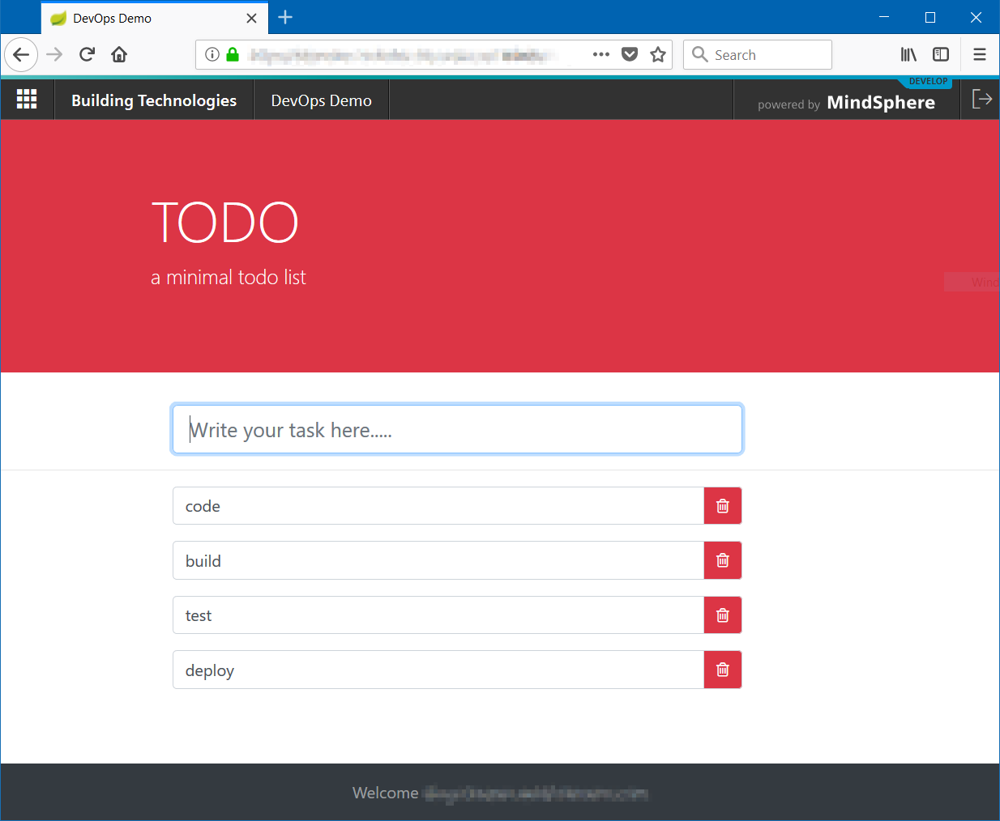
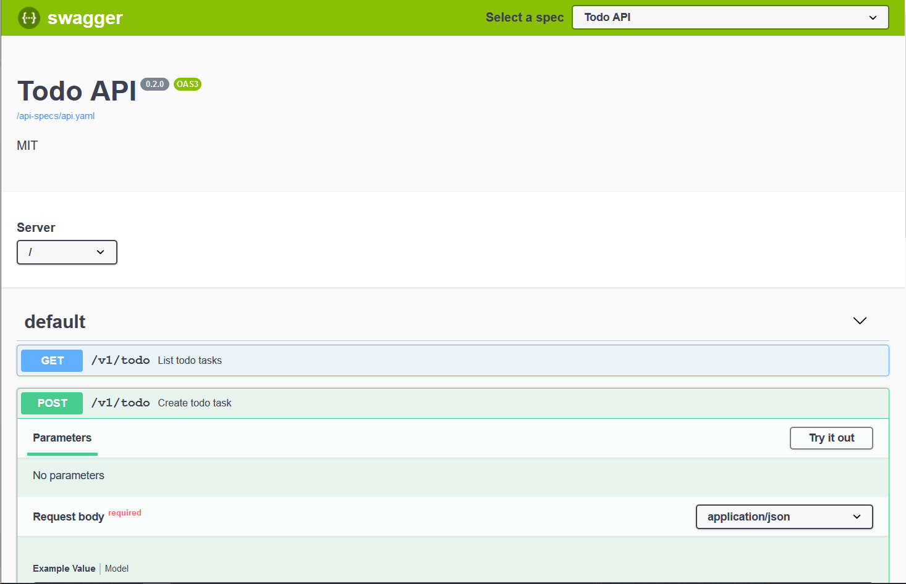
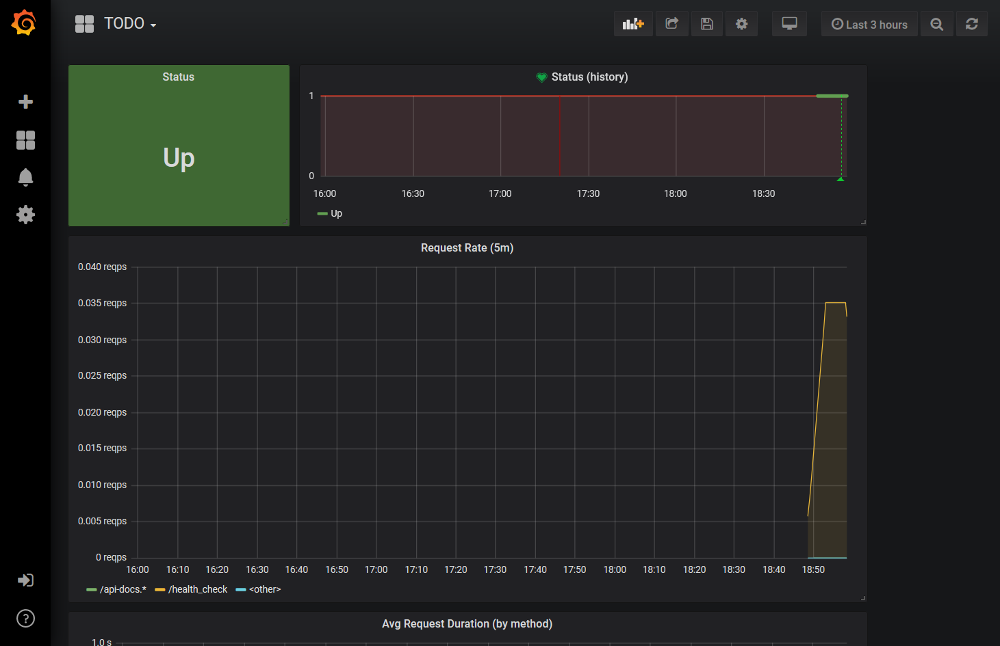

# Devops Demo - <small>Overview</small>

## Introduction

Demo application, providing tools and a devops admin backend for accessing
Prometheus and Grafana.

Presented during MindSphere Developer Days in Berlin, Sept. 2018:

- [Slides](https://github.com/mindsphere/mindsphere.github.io/raw/master/docs/devops-demo/DevOps_with_MindSphere.pdf)
- [Video recording](https://www.youtube.com/watch?v=S8Hul5YeCrw)

[<i class="fab fa-gitlab"></i> GitLab](https://gitlab.com/mindsphere/devops-demo) [<i class="fab fa-github"></i> GitHub Mirror](https://github.com/mindsphere/devops-demo)

## What is it

Close interaction of development and operations is essential to accelerate
delivery of applications. This is a demo across the whole DevOps cycle with
MindSphere, by using well known and widely used open source tools.

High level architecture diagram (draw.io png with embedded xml):

The demo consists of:

<!-- prettier-ignore-start -->
- a simple todo app using the MEAN (MongoDB, Express.js, Angular, Node.js) stack
    - [<i class="fab fa-github"></i> Angular App](https://github.com/mindsphere/devops-demo/tree/master/) (root folder)
    - [<i class="fab fa-github"></i> Backend](https://github.com/mindsphere/devops-demo/tree/master/server)
        - the backend provides swagger-ui for navigating both the server apis and the MindSphere APIs (under `/api-docs`)
- local Angular dev server setup that proxies requests to MindSphere, allowing local development
- a devops admin backend that provides access to prometheus and grafana
    - [<i class="fab fa-github"></i> devopsadmin app](https://github.com/mindsphere/devops-demo/tree/master/devops/devopsadmin)
    - [<i class="fab fa-github"></i> Prometheus on CloudFoundry](https://github.com/mindsphere/devops-demo/tree/master/devops/prometheus)
    - [<i class="fab fa-github"></i> Grafana on CloudFoundry](https://github.com/mindsphere/devops-demo/tree/master/devops/grafana)
    - a [<i class="fab fa-github"></i> sample agent](https://github.com/mindsphere/devops-demo/tree/master/agent) that can be used to simulate an actual device sending
  IoT data to the MindSphere APIs

<!-- prettier-ignore-end -->

Additionally, [<i class="fab fa-github"></i> tooling to ease ssh connectivity to running cf applications](https://github.com/mindsphere/devops-demo/tree/master/tools/README.md)
is provided.

Please refer to the official MindSphere & CloudFoundry developer documentation
for detailed information about the platform:

- [Developer Documentation <i class="fa fa-external-link-alt"></i>](https://developer.mindsphere.io/)
- [Cloud Foundry Developer Guide <i class="fa fa-external-link-alt"></i>](https://docs.cloudfoundry.org/devguide/)

## ToDo App

The todo app provides examples on CI/CD including unit and e2e tests

## Open API 3 Navigator

OpenAPI documentation (Swagger-UI).

## Grafana Administration Dashboard

Administration dashboard (Grafana)

## Known Issues / Limitations

- Known Issues / Limitations
- The gitlab-ci integration requires manually setting authentication with access and refresh tokens available as protected CI/CD Gitlab Variables, and they need to be renewed every 30 days. This can be copied directly from your CloudFoundry CLI ~/.cf/config.json file after successful cf login.
  Storage for Prometheus is currently transient, pending support for some kind of dynamic persistent storage for apps, or direct support for Prometheus in MindSphere.
- Prometheus metrics http endpoints are read-only but not protected.

## Legal

This project has been released under an [Open Source license](./LICENSE.md). The release may include and/or use APIs to Siemens’ or third parties’ products or services. In no event shall the project’s Open Source license grant any rights in or to these APIs, products or services that would alter, expand, be inconsistent with, or supersede any terms of separate license agreements applicable to those APIs. “API” means application programming interfaces and their specifications and implementing code that allows other software to communicate with or call on Siemens’ or third parties’ products or services and may be made available through Siemens’ or third parties’ products, documentations or otherwise.
