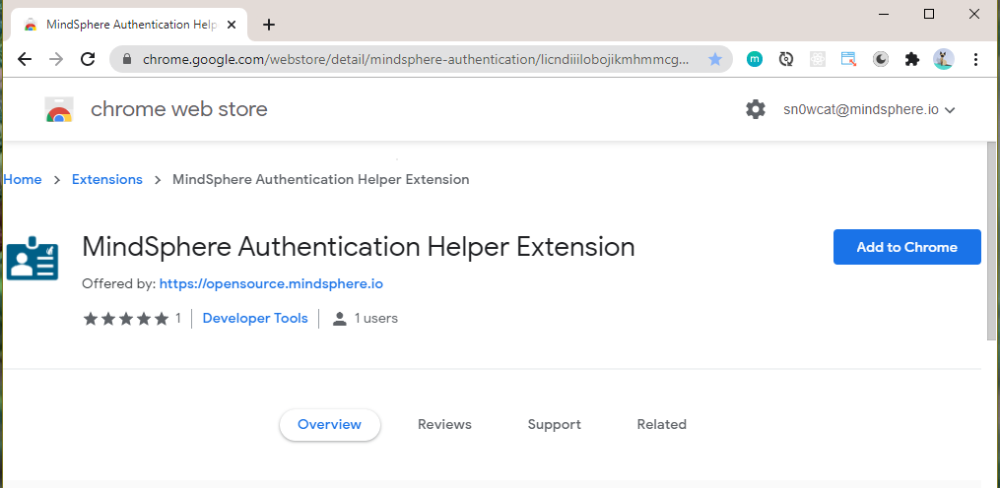
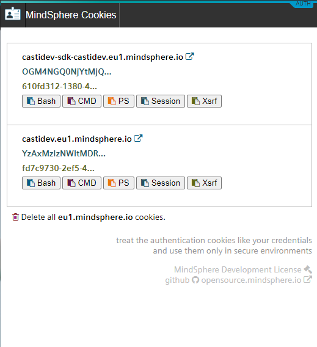
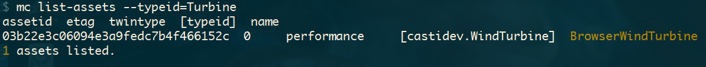
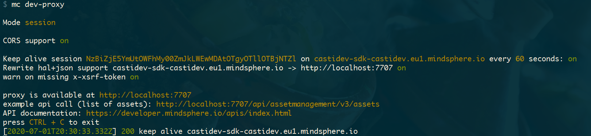

# Industrial IoT Authentication Helper Chrome Extension

This chrome extension can be used to simplify the development tasks for which you need to use the [SESSION and XSRF-TOKEN](https://developer.mindsphere.io/howto/howto-local-development.html#generate-user-credentials) to access Industrial IoT APIs. It provides an easy way to copy the Industrial IoT authentication cookies to the clipboard without having to go to chrome developer tools.

## Installation

Go to [Chrome Web Store:siemens-link-extern:](https://chrome.google.com/webstore/detail/mindsphere-authentication/licndiiilobojikmhmmcgdbpmnmdeoee) chrome web store and click on **add to chrome**.



Once the extension is installed: log in to your Insights Hub tenant, navigate to your application and click on the extension icon to display the available application cookies. You can now click e.g. on **session** or **Xsrf** button which will copy the corresponding cookie to your clipboard.



The cookies can be used with the tools like [curl](https://developer.mindsphere.io/howto/howto-local-development.html#curl-example), [postman](https://developer.mindsphere.io/howto/howto-local-development.html#postman-example_1) etc. (Click on the links for more examples)

### GET example

```bash
#!/bin/bash

curl -vv \
  -G \
  --cookie "SESSION=<session-copied-from=browser>;XSRF-TOKEN=<xsrf-copied-from-browser>" \
  -X GET \
  https://<tenantId>-<appId>-<tenantId>.<regionId>.mindsphere.io/api/assetmanagement/v3/assets
```

### PUT example

```bash
#!/bin/bash

curl -v \
   -X PUT https://<tenantId>-<appId>-<tenantId>.<regionId>.mindsphere.io/api/<puturl> \
  --cookie "SESSION=<session-copied-from=browser>;XSRF-TOKEN=<xsrf-copied-from-browser>" \
  --header "x-xsrf-token: <xsrf-copied-from-browser>" \
  --header "Content-Type: application/json" \
  --data-bin @<your data>
```

## Using the cookies with Industrial IoT CLI

The extension works really well with the Industrial IoT CLI in the [Session Cookie - XSRF-Token Configuration](../mindconnect-nodejs/cli/setting-up-the-cli.md) because the **Bash**, **PS**, and **CMD** buttons already copy the cookies in the required format for Industrial IoT CLI.

Use the extension to copy the cookies to the clipboard, paste them to the command line and start using the [MindSphere CLI](../mindconnect-nodejs/cli/index.md) right away.



## Using the cookies with Industrial IoT Development Proxy

You can also use the extension to simplify the start of [MindSphere Development Proxy](../mindconnect-nodejs/cli/development-proxy.md) in a similar fashion. Just copy/paste the cookies to the command line and start the development proxy.



This will start the development proxy with the credentials of the logged in users so that you can test the Industrial IoT authentication and authorization also in the local environment.

**Important: Treat the authentication cookies like your credentials and use them only in secure environments.**
