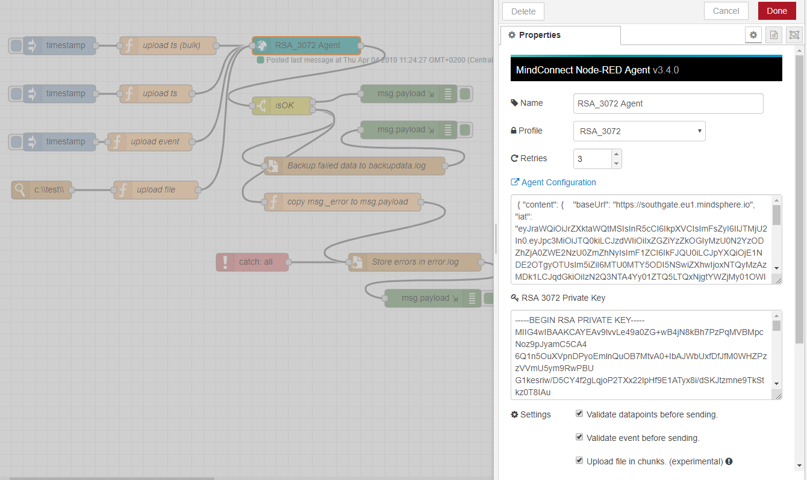

# MindConnect Node-RED Node Overview

## Introduction

A Node-RED node which can be used to upload the time series data, files and events to Insights Hub via MindConnect. The node also has support for the Industrial Data Lake. It runs on x86, Raspberry PI, Siemens IOT 2040 and is also available as a docker container for your convenience.

* [GitHub:siemens-link-extern:](https://github.com/mindsphere/node-red-contrib-mindconnect)
* [npm:siemens-link-extern:](https://www.npmjs.com/package/@mindconnect/node-red-contrib-mindconnect)

The node is written in typescript/javascript without any native dependencies so it should work beside x86 also on other platforms (e.g. on raspberry pi,
[Simatic IoT2000 Gateways:siemens-link-extern:](https://w3.siemens.com/mcms/pc-based-automation/en/industrial-iot/Pages/Default.aspx?tabcardname=simatic%20iot2000%20io-shield), [Siemens Industrial Edge](../../industrial-edge/index.md) etc. You just need [Node-RED:siemens-link-extern:](https://nodered.org).

## About MindConnect Node-RED Node

The Node-RED platform targets the makers who want an easy, flow-based way to configure and manage the flow of data with their IoT devices. This node provides the connectivity to Insights Hub for TimeSeries upload, File upload and Event Creation.

## Using the Mindconnect Node-RED Node

Take a look at the [MindConnect Node-RED Playground:siemens-link-extern:](https://playground.mindconnect.rocks).
