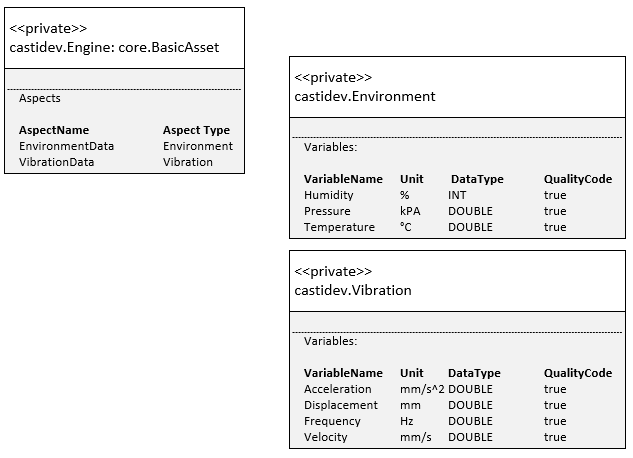
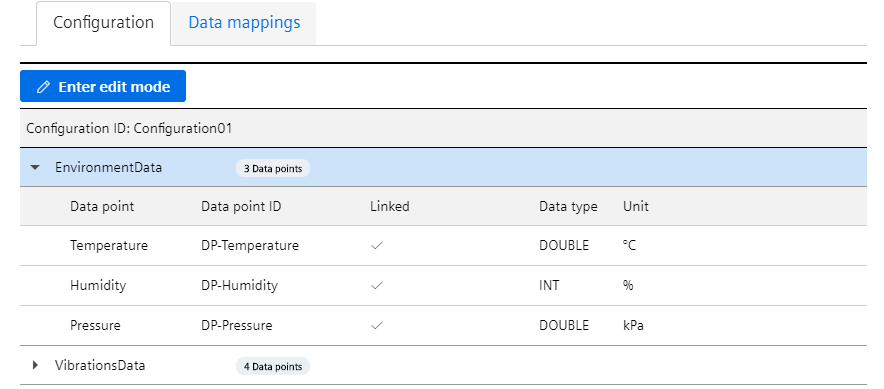
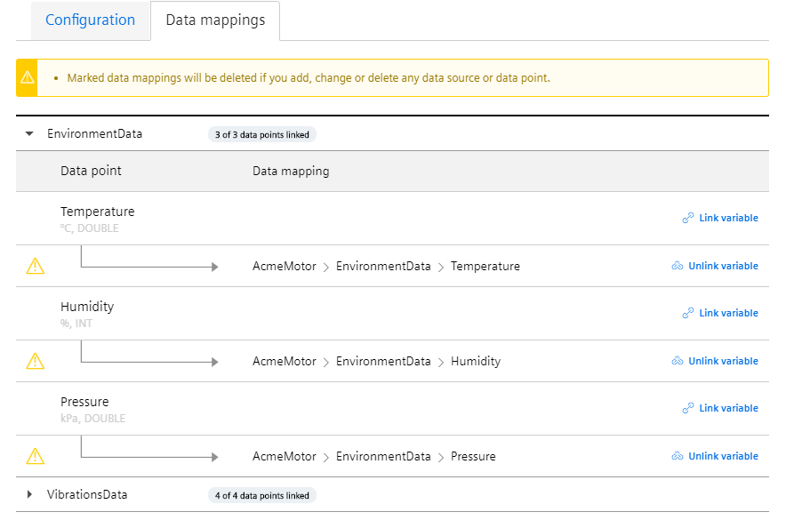
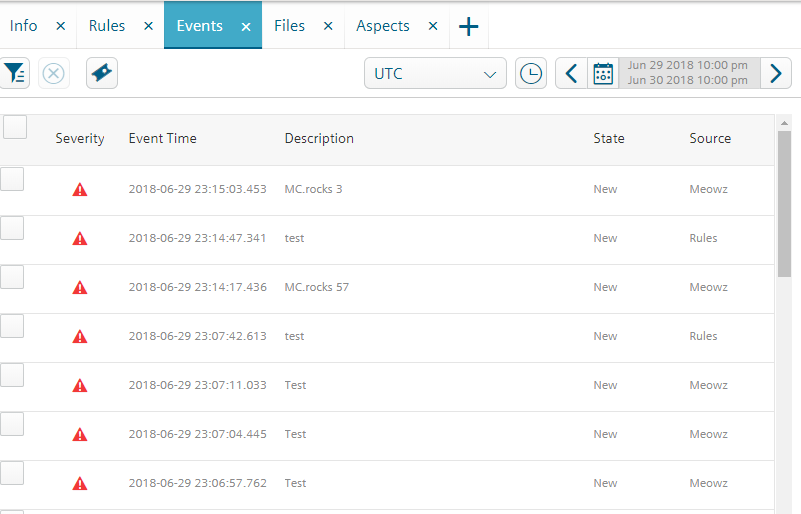
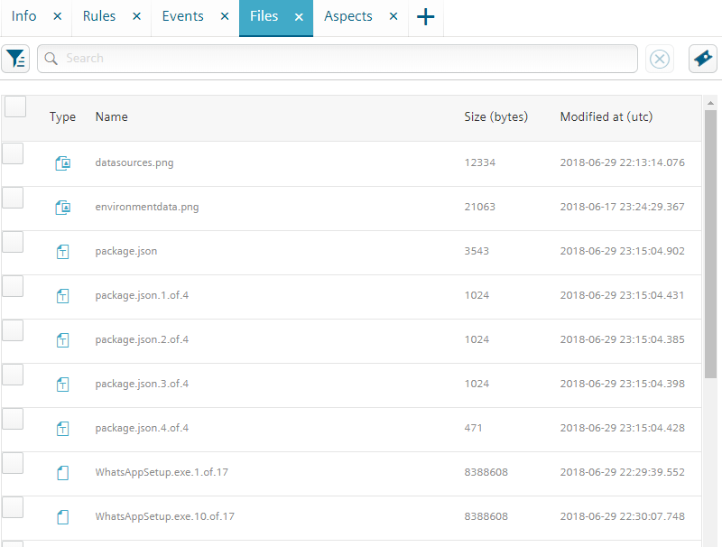

<!-- @format -->

# MindConnect-NodeJS - Agent Development - <small>Getting Started</small>

The easiest way to start is to use the provided command line interface to create a starter project:

```bash
# for typescript nodejs project run
npx @mindconnect/mindconnect-nodejs starter-ts

# for javascript nodejs project run
npx @mindconnect/mindconnect-nodejs starter-js

# if you have CLI installed

# for typescript project
mc create-ts

# for javascript project
mc create-js
```

## TypeScript vs JavaScript

All examples are in [typescript <i class="fa fa-external-link-alt"></i>](https://www.typescriptlang.org/). They can be converted to javascript by removing the types.

```javascript
// example in typescript
const i: number = 0;

// example in javascript
const i = 0;
```

## async/await vs Promises

The examples use the async/await syntax for the promises (available in typescript and in javascript from EcmaScript8)

```javascript
try {
    await agent.OnBoard();
    console.log("agent was successfully onboarded");
} catch (err) {
    console.log(err);
}
```

But you can also write code like this using the classical promise syntax:

```javascript
agent.OnBoard()
    .then (function() {
        console.log("agent was successfully onboarded";
    )}
    ).error(function(err){
        console.log(err)
    });
```

## How to create a nodejs MindSphere agent

The following steps describe the easiest way to test the library. You can of course create the required dependencies also programmatically via API calls.

### Step 0: Create an asset type and aspect types

MindSphere V3 IoT model requires that you create an asset type and aspect types to describe your assets. For the example we will create an asset type of type Engine with two aspect types: Environment and Vibration. (Note that my tenant is called castidev, you will have to use your own tenant name)



More information about [MindSphere Data Model](https://siemens.mindsphere.io/en/docs/tutorials/asset-manager).

### Step 1: Create an asset

Create an asset (In example it is called **AcmeMotor**) of type Engine in AssetManager for your data.

### Step 2: Create an agent of type MindConnectLib in MindSphere

Create an agent in Asset Manager of type MindConnectLib (core.mclib) create initial JSON token and store it to file (e.g. agentconfig.json)

```json
{
    "content": {
        "baseUrl": "https://southgate.eu1.mindsphere.io",
        "iat": "<yourtokenishere>",
        "clientCredentialProfile": ["SHARED_SECRET"],
        "clientId": "a3ac5ae889544717b02fa8282a30d1b4",
        "tenant": "<yourtenantishere>"
    },
    "expiration": "2018-04-06T00:47:39.000Z"
}
```

More Information about [MindConnectLib](http://bit.ly/2HZ2ehE) configuration.

### Step 3 : Create an agent

Read the initial configuration from the config file and create the agent.
If you are using the **SHARED_SECRET** profile there is no need to setup the local certificate for the communication (recommended for smaller devices).

```javascript
const configuration = require("../../agentconfig.json");
const agent = new MindConnectAgent(configuration);
```

If you want to use the **RSA_3072** profile you must also set up the agent certificate.

```javascript
// you can create the private.key for example using openssl:
// openssl genrsa -out private.key 3072

agent.SetupAgentCertificate(fs.readFileSync("private.key"));
```

### Step 4: Onboard the agent

The first operation is onboarding of the agent. This creates a client secret which is used for the communication with MindSphere.

This data is stored by default in the .mc folder in your application if you don't change the base path in the constructor of the agent.

**Important**: Make sure that your folder with the configurations is not reachable from the internet as it contains the client_secret for the authentication.

```javascript
if (!agent.IsOnBoarded()) {
    await agent.OnBoard();
}
```

### Step 5: Configure the data model and data mappings to asset variables. (via code)

**Important**: From the version 3.8.0 it is possible to create the data source configuration and data mappings fully automatic via code

First you need to create a data source configuration

```javascript
// create data source configuration for an asset type castidev.Engine
const generatedConfig = await agent.GenerateDataSourceConfiguration(`${agent.GetTenant()}.Engine`);
await agent.PutDataSourceConfiguration(generatedConfig);
```

and then the data mappings:

```javascript
const mappings = await agent.GenerateMappings(targetAssetId);
await agent.PutDataMappings(mappings);
```

### Step 5a: Create automatic mapping to target asset

If you are just creating 1:1 asset to agent mappings the two steps above can be shortened into:

```javascript
/// instead of creating the data source configuration and mappings separately
// you can also just use the method below which takes care of everything
// this is only used for 1:1 asset -> agent mappings
// the method above can also map the data source configuration to multiple assets
// just call GenerateMappings with different asset ids

await agent.ConfigureAgentForAssetId(targetAssetId);
```

### SDK access: The agents have now access to MindSphere TypeScript SDK

```javascript
agent.Sdk();
// the sdk gives you access to e.g. asset management client with which you can get asset types or assets from mindsphere
// which can be used for automatic data source configuration and automatic mappings

const assetMgmt = agent.Sdk().GetAssetManagementClient();
await assetMgmt.GetAssets(...);
await assetMgmt.GetAspectTypes(...);

```

If you take a look at the MindSphere configuration of your agent now it should look like this:



And the data mappings should be in place



### Step 6 After this you can send the data in the code

```javascript
for (let index = 0; index < 5; index++) {
    const values: DataPointValue[] = [
        {
            dataPointId: "DP-Temperature",
            qualityCode: "0",
            value: (Math.sin(index) * (20 + (index % 2)) + 25).toString(),
        },
        {
            dataPointId: "DP-Pressure",
            qualityCode: "0",
            value: (Math.cos(index) * (20 + (index % 25)) + 25).toString(),
        },
        { dataPointId: "DP-Humidity", qualityCode: "0", value: ((index + 30) % 100).toString() },
        { dataPointId: "DP-Acceleration", qualityCode: "0", value: (1000.0 + index).toString() },
        { dataPointId: "DP-Frequency", qualityCode: "0", value: (60.0 + index * 0.1).toString() },
        { dataPointId: "DP-Displacement", qualityCode: "0", value: (index % 10).toString() },
        { dataPointId: "DP-Velocity", qualityCode: "0", value: (50.0 + index).toString() },
    ];

    // there is an optional timestamp parameter if you need to use something else instead of Date.now()
    const result = await agent.PostData(values);
}
```

(If you were using UI to configure data mappings you will have long integers instead of human-readable data point Ids.)

### Step 6.1 using bulk upload

If you don't want to send the data points one by one, you can also use the BulkPostData method

```javascript
const bulk: TimeStampedDataPoint[] = [
    {
        timestamp: "2018-08-23T18:38:02.135Z",
        values: [
            { dataPointId: "DP-Temperature", qualityCode: "0", value: "10" },
            { dataPointId: "DP-Pressure", qualityCode: "0", value: "10" },
        ],
    },
    {
        timestamp: "2018-08-23T19:38:02.135Z",
        values: [
            { dataPointId: "DP-Temperature", qualityCode: "0", value: "10" },
            { dataPointId: "DP-Pressure", qualityCode: "0", value: "10" },
        ],
    },
];

await agent.BulkPostData(bulk);
```

## Events

Events can now be created with the library. You can create events for your agent or for your entities. In order to create an event for your entity you need to know the assetId of the asset.

```javascript
const configuration = require("../../agentconfig.json");
const agent = new MindConnectAgent(configuration);

if (!agent.IsOnBoarded()) {
    await agent.OnBoard();
}

const event: MindsphereStandardEvent = {
    entityId: configuration.content.clientId, // use assetid if you dont want to store event in the agent :)
    sourceType: "Event",
    sourceId: "application",
    source: "Meowz",
    severity: 20, // 0-99 : 20:error, 30:warning, 40: information
    timestamp: new Date().toISOString(),
    description: "Test",
};

// send event with current timestamp
await agent.PostEvent(event);
```



## File Upload

Files can now be uploaded via the library. You can upload files for your agent or for your entities. In order to create an event for your entity you need to know the assetId of the asset.

Since version 3.5.1. the agents are using the multipart upload API of the MindSphere. This means that the agents can upload files also bigger > 8 MB, The
multipart upload must be switched on (chunk:true) if you want to activate this behavior. The parameter parallelUploads determine the maximal number of parallel uploads. You can increase this on a powerful computer to speed up the upload or decrease to prevent network congestion.

```javascript
const configuration = require("../../agentconfig.json");
const agent = new MindConnectAgent(configuration);

if (!agent.IsOnBoarded()) {
    await agent.OnBoard();
}

await agent.UploadFile(agent.ClientId(), "custom/mindsphere/path/package.json", "package.json", {
    retry: RETRYTIMES,
    description: "File uploaded with MindConnect-NodeJS Library",
    parallelUploads: 5,
    chunk: true,
});
```



## Full Agent

Here is a demo agent implementation.

[](https://github.com/mindsphere/mindconnect-nodejs/blob/master/src/demoagent/test-agent.ts)

The data in the MindSphere can be observed in the fleet manager.
