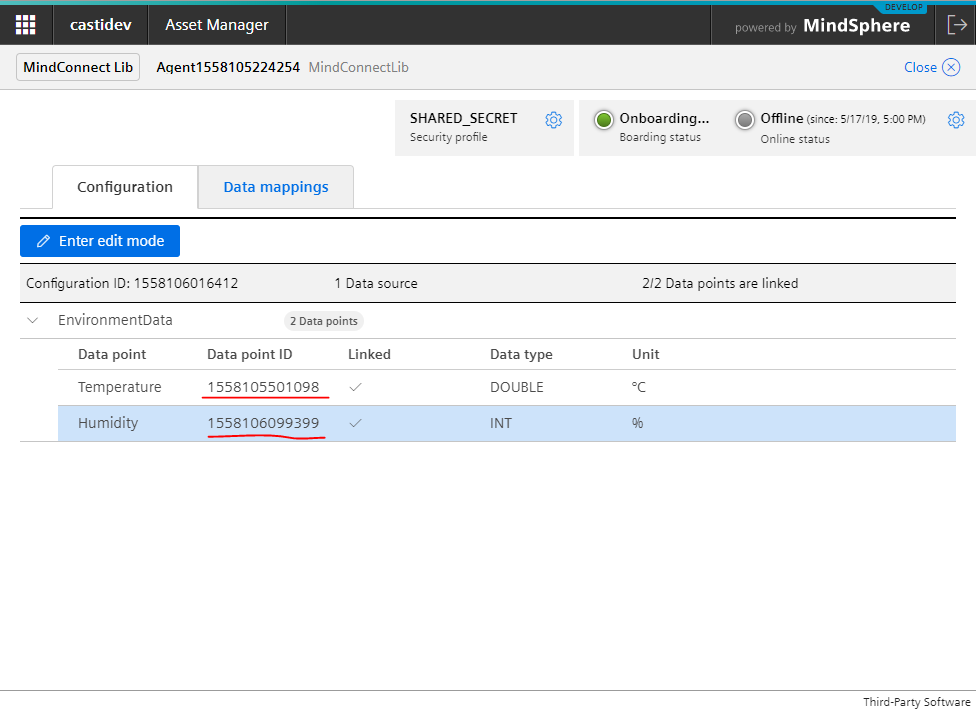
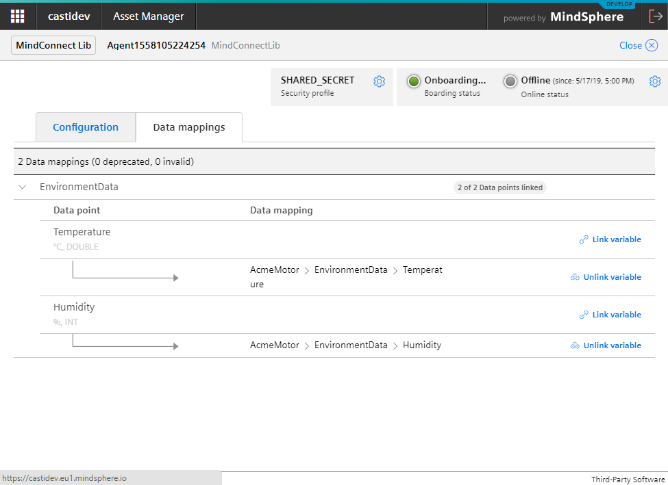

# Mindconnect-NodeJS - Agent Development - <small>Starter Projects</small>

## Introduction

The easiest way to start the development is to use the CLI to generate the starter projects

## Prerequisites

You will need the service credentials and the [installed CLI](../cli/setting-up-the-cli.md).

## Step 1 - Create the project with help of the CLI

### Example

Use the CLI to setup a starter project called my-agent:

```bash
mc createts --dir my-agent
```

This will provide following output:

```text
Starter project in my-agent has been created.
Please run npm install in my-agent directory to install dependecies.
```

```bash
# after this we will install the required dependencies

cd my-agent
npm install
```

This should be the result of the installation

```text
npm notice created a lockfile as package-lock.json. You should commit this file.
npm WARN mc-agent-ts@1.0.0 No repository field.
npm WARN mc-agent-ts@1.0.0 license should be a valid SPDX license expression

added 69 packages from 132 contributors and audited 88 packages in 24.888s
found 0 vulnerabilities
```

After this create the agentconfig.json with help of the CLI:

```bash
mc create-agent --passkey{your passkey} --config agentconfig.json
```

This will produce following output

```text
Configure your agent at:

        https://{yourtenant}-assetmanager.eu1.mindsphere.io/entity/{agentid}/plugin/uipluginassetmanagermclib
```

## Step 2 - Configuring the agent

Click on the link provided by the CLI and configure the agent in the MindSphere.



Link the variables to an asset:



## Step 3 - Change the IDs to your Datapoint Ids and start the agent

```javascript
import {
  DataPointValue,
  MindConnectAgent,
  MindsphereStandardEvent,
  retry,
  TimeStampedDataPoint
} from "@mindconnect/mindconnect-nodejs";

(async function() {
  const sleep = (ms: any) => new Promise(resolve => setTimeout(resolve, ms));
  const configuration = require("./agentconfig.json");
  const agent = new MindConnectAgent(configuration);
  const log = (text: any) => {
    console.log(`[{new Date().toISOString()}] {text.toString()}`);
  };
  const RETRYTIMES = 5; // retry the operation before giving up and throwing exception

  for (let index = 0; index < 5; index++) {
    try {
      log(`Iteration : {index}`);
      // onboarding the agent
      if (!agent.IsOnBoarded()) {
        // wrapping the call in the retry function makes the agent a bit more resilliant
        // if you don't want to retry the operations you can always just call await agent.OnBoard(); instaead.
        await retry(RETRYTIMES, () => agent.OnBoard());
        log("Agent onboarded");
      }

      if (!agent.HasDataSourceConfiguration()) {
        await retry(RETRYTIMES, () => agent.GetDataSourceConfiguration());
        log("Configuration aquired");
      }

      const values: DataPointValue[] = [
        {
          dataPointId: "1558105501098",
          qualityCode: "0",
          value: (Math.sin(index) * (20 + (index % 2)) + 25).toString()
        },
        {
          dataPointId: "1558106099399",
          qualityCode: "0",
          value: ((index + 30) % 100).toString()
        }
      ];

      // same like above, you can also just call  await agent.PostData(values) if you don't want to retry the operation
      // this is how to send the data with specific timestamp
      // await agent.PostData(values, new Date(Date.now() - 86400 * 1000));

      await retry(RETRYTIMES, () => agent.PostData(values));
      log("Data posted");
      await sleep(1000);

      const event: MindsphereStandardEvent = {
        entityId: agent.ClientId(), // use assetid if you want to send event somewhere else :)
        sourceType: "Event",
        sourceId: "application",
        source: "Meowz",
        severity: 20, // 0-99 : 20:error, 30:warning, 40: information
        timestamp: new Date().toISOString(),
        description: "Test"
      };

      // send event with current timestamp; you can also just call agent.PostEvent(event) if you don't want to retry the operation
      await retry(RETRYTIMES, () => agent.PostEvent(event));
      log("event posted");
      await sleep(1000);

      // upload file
      // the upload-file can be a multipart operation and therefore can be configured to
      // retry the upload of the chunks instead the upload of the whole file.
      // if you don't specify the type , the mimetype is automatically determined by the library
      await agent.UploadFile(
        agent.ClientId(),
        "custom/mindsphere/path/package.json",
        "package.json",
        {
          retry: RETRYTIMES,
          description: "File uploaded with MindConnect-NodeJS Library",
          chunk: true // the chunk parameter activates multipart upload
        }
      );

      const yesterday = new Date();
      yesterday.setDate(yesterday.getDate() - 1);
      const bulk: TimeStampedDataPoint[] = [
        {
          timestamp: yesterday.toISOString(),
          values: [
            { dataPointId: "1558106099399", qualityCode: "0", value: "10" },
            { dataPointId: "1558105501098", qualityCode: "0", value: "10" }
          ]
        },
        {
          timestamp: new Date().toISOString(),
          values: [
            { dataPointId: "1558106099399", qualityCode: "0", value: "10" },
            { dataPointId: "1558105501098", qualityCode: "0", value: "10" }
          ]
        }
      ];

      await retry(RETRYTIMES, () => agent.BulkPostData(bulk));
      log("bulk data uploaded");
      await sleep(1000);
    } catch (err) {
      // add proper error handling (e.g. store data somewhere, retry later etc. )
      console.error(err);
    }
  }
})();
```

## Start the agent

```bash
npm start
```

This should produce the output like this:

```bash
> mc-agent-ts@1.0.0 start C:\git\my-agent
> tsc && node index.js

[2019-05-17T15:41:11.375Z] Iteration : 0
[2019-05-17T15:41:13.495Z] Agent onboarded
[2019-05-17T15:41:14.398Z] Configuration aquired
[2019-05-17T15:41:14.958Z] Data posted
[2019-05-17T15:41:16.409Z] event posted
[2019-05-17T15:41:18.285Z] bulk data uploaded
[2019-05-17T15:41:19.288Z] Iteration : 1
[2019-05-17T15:41:19.716Z] Data posted
[2019-05-17T15:41:21.325Z] event posted
[2019-05-17T15:41:23.445Z] bulk data uploaded
[2019-05-17T15:41:24.447Z] Iteration : 2
[2019-05-17T15:41:24.886Z] Data posted
[2019-05-17T15:41:26.289Z] event posted
[2019-05-17T15:41:30.744Z] bulk data uploaded
```
