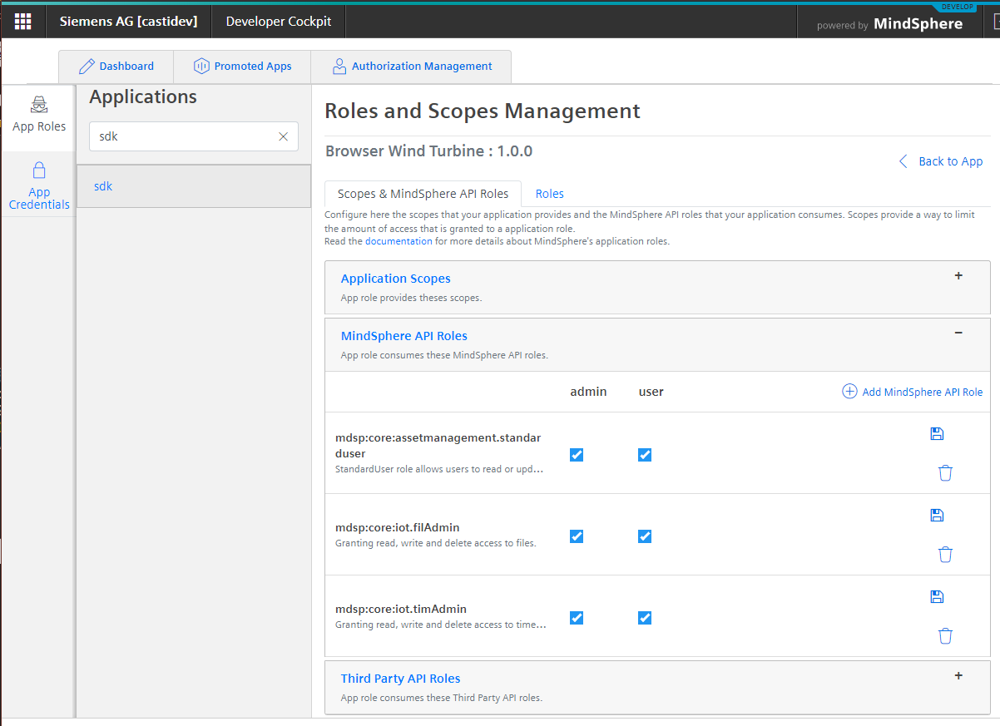
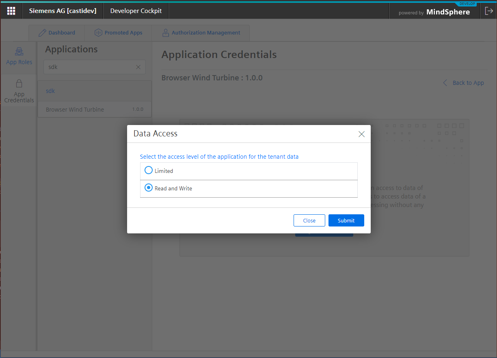
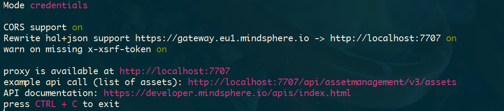

<!-- @format -->

# MindConnect-NodeJS - <small>Development Proxy</small>

The CLI comes with a development proxy which can be used to kickstart your MindSphere development. It provides an endpoint
at your local machine at

[http://localhost:7707](http://localhost:7707)

which will authenticate all requests using either one of:

- [SESSION and XSRF-TOKEN cookie](https://developer.mindsphere.io/howto/howto-local-development.html#generate-user-credentials) - **Recommended**
- [Application Credentials](https://documentation.mindsphere.io/resources/html/developer-cockpit/en-US/124342231819.html) - **Recommended**
- [Service Credentials](https://developer.mindsphere.io/howto/howto-selfhosted-api-access.html#creating-service-credentials)

## Developing with SESSION and XSRF-TOKEN Cookie

First you should deploy an application to your tenant and configure its user rights. (any frontend app will do, including just an empty index.html. The important part is that you have configured the MindSphere API scopes for your application).



After that navigate to your application and create the MDSP_HOST, MDSP_SESSION and MDSP_XSRF_TOKEN like this (example bash shell, see [setting up the cli](setting-up-the-cli.html) for PowerShell and CMD examples

```bash
export MDSP_HOST="castidev-sdk-castidev.eu1.mindsphere.io"
export MDSP_SESSION="NzBi...Zl"
export MDSP_XSRF_TOKEN="fed5edc5-...2565238c114"
```

After that the proxy will authorize all requests to MindSphere as if the app would be deployed and if you would be logged in.

```bash
mc dev-proxy
```


## Developing with Application Credentials

First you should deploy an application to your tenant as before. After that navigate to AppCredentials section in your developer cockpit and issue app credentials for your application.



Configure the CLI using the

```bash
mc service-credentials
```

command and select your application if you have multiple credentials configured.

Start the proxy using the `-mode credentials` switch.

```bash
mc dev-proxy --mode credentials --passkey <yourpasskey>
```

After that the proxy will authorize all requests to MindSphere with selected Application Credentials.



## Development Proxy options

Run `mc dev-proxy --help` for options:

```text
Usage: mc dev-proxy|px [options]

starts mindsphere development proxy (optional passkey) *

Options:
  -m, --mode [credentials|session]  service/app credentials authentication of
                                    session authentication (default: "session")
  -o, --port <port>                 port for web server (default: "7707")
  -r, --norewrite                   don't rewrite hal+json urls
  -w, --nowarn                      don't warn for missing headers
  -d, --dontkeepalive               don't keep the session alive
  -v, --verbose                     verbose output
  -s, --session <session>           borrowed SESSION cookie from brower
  -x, --xsrftoken <xsrftoken>       borrowed XSRF-TOKEN cookie from browser
  -h, --host <host>                 the address where SESSION and XSRF-TOKEN
                                    have been borrowed from
  -t, --timeout <timeout>           keep alive timeout in seconds (default:
                                    "60")
  -k, --passkey <passkey>           passkey
  --help                            display help for command

  Examples:

    mc dev-proxy                                 runs on default port (7707) using cookies
    mc dev-proxy --port 7777 --passkey passkey   runs on port 7777 using app/service credentials

  Configuration:

        - create environment variables: MDSP_HOST, MDSP_SESSION and MDSP_XSRF_TOKEN using borrowed cookies

    see more documentation at https://opensource.mindsphere.io/docs/mindconnect-nodejs/development-proxy.html
```

## Example

This video shows how to use the development proxy in combination with React web application using frontend authentication.

<video style='width: 100% !important; height: auto !important;' controls>
  <source src="../images/using_dev_proxy.mp4" type="video/mp4">
Your browser does not support the video tag.
</video>
