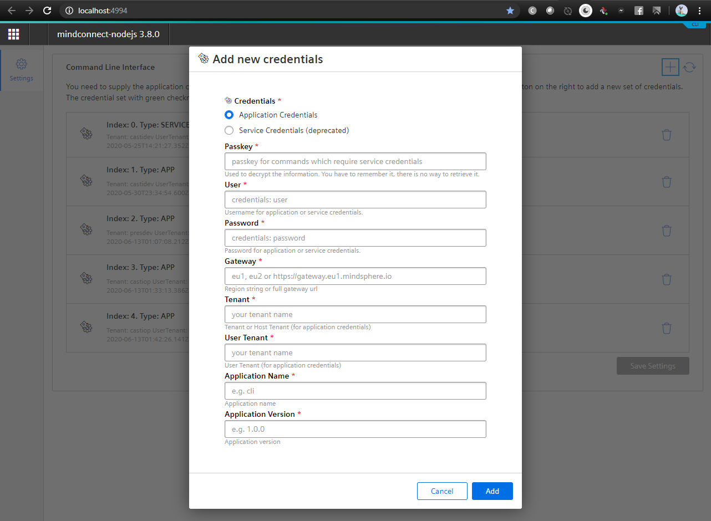
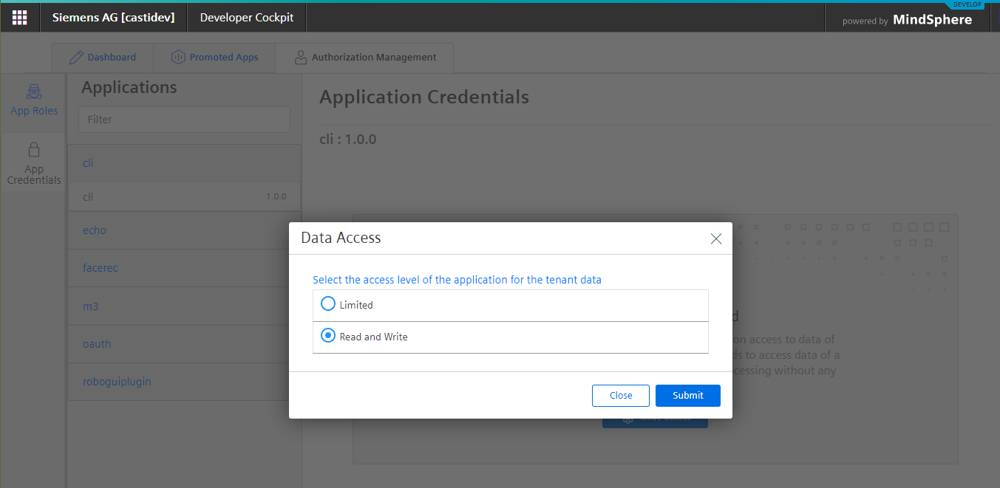
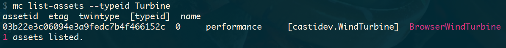
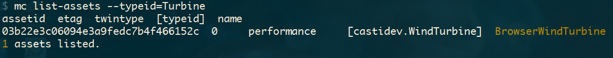
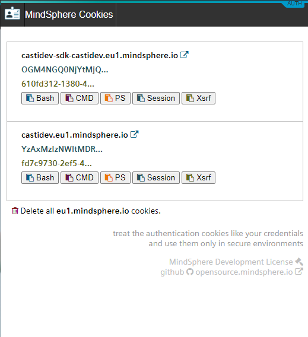

<!-- @format -->

# MindConnect-NodeJS - <small>Setting up the CLI</small>

The first step is to configure the CLI. For this, you will need application credentials  (or deprecated service credentials) from your developer cockpit or SESSION and XSRF-TOKEN from the application you have been developing.

-   [Application Credentials](https://documentation.mindsphere.io/resources/html/developer-cockpit/en-US/124342231819.html) - **Recommended**
-   [Service Credentials](https://developer.mindsphere.io/howto/howto-selfhosted-api-access.html#creating-service-credentials) (deprecated)
-   [SESSION and XSRF-TOKEN cookie](https://developer.mindsphere.io/howto/howto-local-development.html#generate-user-credentials)

**Important:** the service credentials (which are now deprecated) could only be acquired by emailing MindSphere Support. They are not connected to the _Cloud Foundry Service Credentials_ from MindSphere settings app.

## Application Credentials / Service Credentials Configuration

First start the credentials configuration. This will start a web server on your local computer where you can enter the credentials.

```bash
# run mc service-credentials --help for full information

$ mc service-credentials
navigate to http://localhost:4994 to configure the CLI
press CTRL + C to exit

```

Navigate to [http://localhost:4994](http://localhost:4994) to configure the CLI. (see [full documentation](https://opensource.mindsphere.io/docs/mindconnect-nodejs/cli/index.html) for XSRF-TOKEN and SESSION)

The image below shows the dialog for adding new credentials (press on the + sign in the upper left corner)



You can get the application credentials from your developer or operator cockpit in MindSphere. (if you don't have any application you can register a dummy one just for CLI)



Once configured you can press CTRL + C to stop the configuration server and start using the CLI. Remember the passkey you have created ,as you will be using it with almost all CLI commands.

## Passkey as environment variable

If you don't want to enter your passkey all the time you can also set it up as Environment Variable `MDSP_PASSKEY'

This will save you the typing of the `--passkey` option most of the time. Remember that this is not as secure as typing it in. Use with care.

Bash:

```bash
export MDSP_PASSKEY="my.complex.passkey"
```

Windows CMD

```cmd
set "MDSP_PASSKEY=my.complex.passkey"
```

Windows PowerShell

```powershell
$Env:MDSP_PASSKEY="my.complex.passkey"
```

The results of the commands will be colored in magenta if you are using Application of Service Credentials.



## Session Cookie - XSRF-Token configuration

You can also use the SESSION Cookie and XSRF-TOKEN from the application you are developing in the CLI. Just configure following environment variables.

```bash
export MDSP_HOST="mytenant-myapp.eu1.mindsphere.io"
export MDSP_SESSION="ZDcyMWVkNjMtYXXXXXXXlkYmQtODYxZDljZjIzOGI1"
export MDSP_XSRF_TOKEN="33771ee2-9650-XXXX-ab73-10f52cad12bf"
```

Windows CMD

```bash
set "MDSP_HOST=mytenant-myapp.eu1.mindsphere.io"
set "MDSP_SESSION=ZDcyMWVkNjMtYXXXXXXXlkYmQtODYxZDljZjIzOGI1"
set "MDSP_XSRF_TOKEN=33771ee2-9650-XXXX-ab73-10f52cad12bf"
```

Windows PowerShell

```bash
$Env:MDSP_HOST="mytenant-myapp.eu1.mindsphere.io";
$Env:MDSP_SESSION="ZDcyMWVkNjMtYXXXXXXXlkYmQtODYxZDljZjIzOGI1";
$Env:MDSP_XSRF_TOKEN="33771ee2-9650-XXXX-ab73-10f52cad12bf";
```

The results of the commands will be colored yellow if you are using SESSION / XSRF-TOKEN type of authorization.



The use of Service or Application credentials always takes precedence over Session Cookie / XSRF-TOKEN Authentication.

## MindSphere Authentication Helper

You can use the [Mindsphere Auth Helper](../../mindsphere-auth-helper/index.html) Chrome extension (<a href="https://chrome.google.com/webstore/detail/mindsphere-authentication/licndiiilobojikmhmmcgdbpmnmdeoee"><i class="fab fa-chrome"></i> chrome web store</a>
) to simplify the copying of the authentication cookies. The extension already
provides the cookies in the proper format for the CLI so that you don't have to craft the MDSP_HOST, MDSP_SESSION and MDSP_XSRF_TOKEN variable manually.


