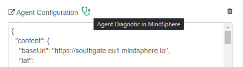
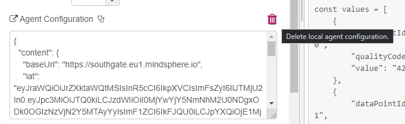

<!-- @format -->

---

# Troubleshooting Tips

Most troubleshooting tips apply for both the mindconnect-nodejs library and the Node-RED node.

## Connection can't be established

An error like this indicates that there is some problem with network connectivity between your computer and MindSphere.

```text
Network error occured request to https://<tenant>.piam.eu1.mindsphere.io/oauth/token failed,
reason: connect ECONNREFUSED
```

This can be caused by several reasons (and in the very rare case, the MindSphere could be offline) but the most common one is that your http proxy is not properly configured.

The proxy configuration is set via environment variables:

```bash
# set http proxy environment variable
export HTTP_PROXY=http://localhost:8888
```

If you are using node-RED make sure that the environment variable is created **before the node-RED process is started**, especially if you are running it as a service.

### MindSphere Online Status

If you are convinced that your proxy settings are correctly set, it also might be that MindSphere is undergoing occasional offline maintenance. The current status of all Mindsphere services is available at:

<https://status.mindsphere.io/>

## The library/node are sending the data but there is no data in Fleet Manager

This is probably caused by some misconfiguration in your data source configuration and/or in the mappings. Please use Agent Diagnostic Tool on your MindSphere dashboard to troubleshoot the issue.


If you are using node-RED node, there is a link leading directly to the diagnostic tool in the node-red configuration.



## The client secret has expired you will have to onboard your agent again

This indicates that the agent authentication is not working anymore and that you will have to onboard the agent again.

```text
the client secret has expired, you will have to onboard the agent again
(possible cause for this error is invalid date/time on the device)
```

Here are some probable causes:

### The agent hasn't called MindSphere APIs for a long time

If your agent is calling MindSphere APIs only occasionally the authentication secrets might expire. In order to prevent that the Node-RED has an automatic keep alive feature which renews the client secrets even if no data is sent. If you are writing a custom agent make sure that you are doing something like this:

```javascript
setInterval(async () => {
    await retry(5, () => agent.RenewToken());
}, 3600000);
```

### Invalid date/time on the device

The date and time on the device where the agent is running is not configured properly. This can happen on e.g. virtual machines which are put into sleep mode, edge devices and gateways which don't have access to NTP server etc. Please make sure that the time is set properly.

## Error occurred during keep alive (in Node-RED)

```text
Error occured during keep alive
```

If this error occurs in node red, the probable cause is the implementation of keep alive functionality paired with regular deployments.
Prior to the version 3.7.0. the node wasn't clearing the old interval_id timer after redeployment. This could cause a state where two or more concurrent timers were trying to renew the agent token and sometimes the agent would get tangled in the different renewals.

### Mitigation for versions before 3.7.0

Restarting the node-RED after deployment of a new configuration should mitigate the issue.

### Fix in version 3.7.0 and beyond

The version 3.7.0 clears the timers for async logging and token renewal on close similar to the function node of node-red.

See also: <https://github.com/mindsphere/node-red-contrib-mindconnect/issues/76>

## How to reset agent configuration

If you have problems with your agent:

1. Stop the agent.
2. Move or delete the content of the .mc folder (the json files with configuration and authentication settings).
3. Offboard the agent.
4. Create new settings for the mindconnect library.
5. copy the new settings to the node.

### Resetting the agent settings from version 3.7.0 in Node-RED

Since version 3.7.0. it is possible to delete the content of the .mc/agentconfig.json file and the agent settings directly from the node.

Press on the "delete local configuration" :wastebucket: button on the node, confirm the dialog and redeploy the node.



If you are having problems, it is a good idea to restart the Node-RED runtime completely

## Node-RED node 3.9.0 is not loading in chromium on Raspberry Pi

If the node is not loading in your chromium browser on your Raspberry Pi, please either upgrade chromium to a newer version (83.0.\*) or upgrade
the node to the version 3.9.1 which should also work in older chromium versions. (See also the [corresponding issue](https://github.com/mindsphere/node-red-contrib-mindconnect/issues/103) on GitHub.)
