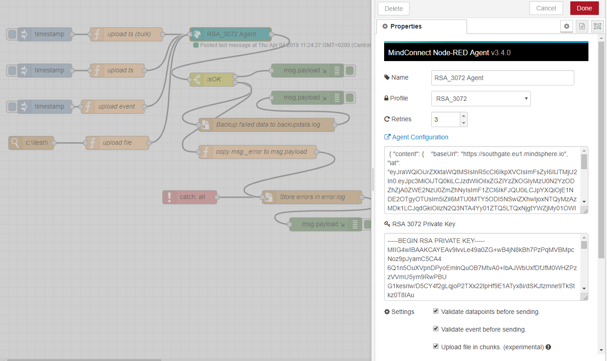

<!-- @format -->

# MindConnect Node-RED Node - <small>Overview</small>

## Introduction

A Node-RED node which can be used to upload the time series data, files and events to MindSphere via MindConnect. The node runs on x86, Raspberry PI, Siemens IOT 2040 and is also available as a docker container for your convenience.

[<i class="fab fa-github"></i> GitHub](https://github.com/mindsphere/node-red-contrib-mindconnect) [<i class="fab fa-npm"></i> npm](https://www.npmjs.com/package/@mindconnect/node-red-contrib-mindconnect) [<i class="fab fa-docker"></i> DockerHub](https://hub.docker.com/r/mindconnect/node-red-contrib-mindconnect)

The node is written in typescript/javascript without any native dependencies so it should work beside x86 also on other platforms (e.g. on raspberry pi, [Simatic IoT2000 Gateways](https://w3.siemens.com/mcms/pc-based-automation/en/industrial-iot/Pages/Default.aspx?tabcardname=simatic%20iot2000%20io-shield), [Siemens Industrial Edge](https://new.siemens.com/global/en/products/automation/topic-areas/industrial-edge.html) etc., you just have to have [Node-RED](https://nodered.org) installed).

## About MindConnect Node-RED Node

The Node-RED platform targets the makers who want an easy, flow-based way to configure and manage the flow of data with their IoT devices. This node provides the connectivity to MindSphere for TimeSeries upload, File upload and Event Creation.

## Using the Mindconnect Node-RED Node

The video below shows how to use the Node-RED node with DemoPump asset which is available in [MindSphere Start for Free Account](https://siemens.mindsphere.io/en/start).

<video style='width: 100% !important; height: auto !important;' controls>
  <source src="images/node-red-start-for-free-no-sound.mp4" type="video/mp4">
Your browser does not support the video tag.
</video>
